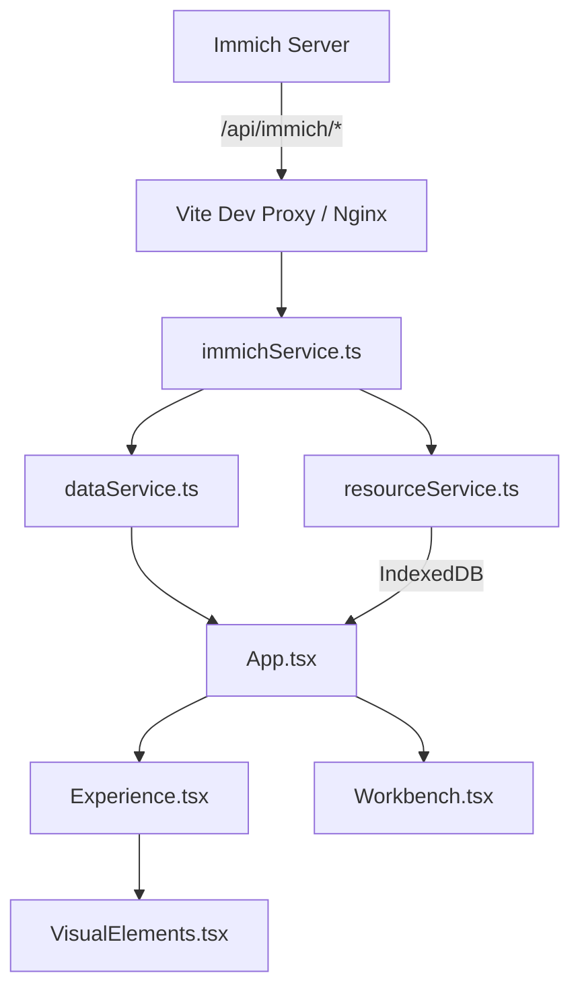
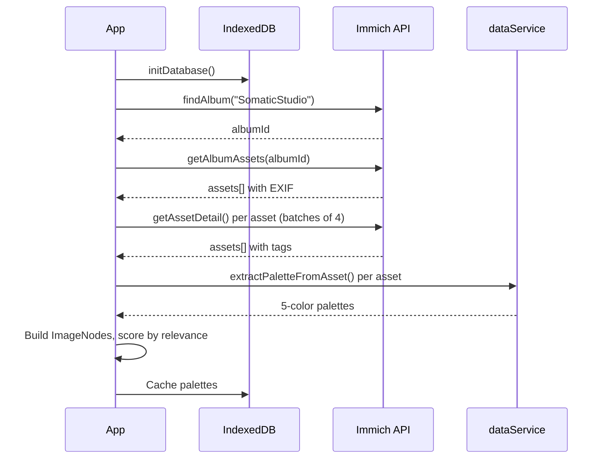
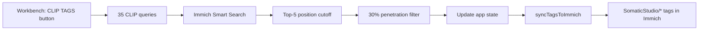

<div align="center">
  <!-- TODO: Add screenshot of Experience Grid view (full EsotericSprite canvas) -->
</div>

# Somatic Studio

> A photography asset management and discovery system — a living web of memory, color, and light. Navigate by feeling, not folders.


---

## Vision

Every photograph carries memory — not just pixels, but the light that afternoon, the hum of the lens, the season encoded in color. Somatic Studio treats images as nodes in a living network, connected by palette, time, subject, and technical DNA. There are no folders, no albums to scroll. You navigate by feeling.

Click any image and the system **anchors** on it — revealing its neighbors by color distance, seasonal proximity, shared tags, and camera/lens match. A portrait shot on golden-hour film stock surfaces beside another from a different year, connected by warmth and shallow focus. The relationships are calculated, but the experience is intuitive.

Two modes shape the interface: **Experience** is the exploration space — a physics-driven canvas of procedural glyphs, orbital neighbors, and color satellites. **Workbench** is the curation layer — a structured grid for tagging, CLIP analysis, and batch operations, hidden behind a 5-click admin gesture.

---

*The rest of this document describes the architecture that makes the feeling possible.*

## Views

### Experience (Visual Exploration)

<!-- TODO: Add screenshot of Image Focus mode (hero image + 12 physics orbit neighbors) -->

- **Grid View** — All images rendered as EsotericSprites in a responsive grid; click to anchor
- **Image Focus** — Hero image centered with 12 related neighbors orbiting via D3 force simulation
- **Filter Views** — Pivot the canvas by tag, color, date, camera, lens, or season
- **Satellite Panels** — "Spectral ID" (color-based navigation) and "Semantic Web" (tag-based navigation)
- **History Timeline** — Fullscreen chronological view of your exploration path
- **Fullscreen Gallery** — Vertical snap-scroll for sequential viewing
- **Field Guide** — Onboarding overlay explaining the navigation metaphor

### Workbench (Admin / Curation)

<!-- TODO: Add screenshot of list grid with multi-select and CLIP TAGS button -->

- **List Grid** — 6-column table with preview thumbnails, dates, tags, technical specs
- **Search** — Full-text across filenames, tags, camera/lens models
- **Multi-Select** — Click, Shift+Click range, Cmd+Click toggle
- **Batch Operations** — Add/remove tags across selection
- **CLIP Smart Search** — AI tagging via Immich's CLIP model (35 labels across 5 categories)
- **Export** — Download `tags.json` and `AI-tags.json`

## Key Concepts

| Concept | Definition |
|---------|-----------|
| **ImageNode** | An image from Immich with EXIF metadata, 5-color palette, manual + AI tags, and capture timestamp |
| **ExperienceNode** | An ImageNode wrapped with D3 physics state — position, velocity, scale, opacity, relevance score |
| **AnchorState** | The current navigation focus: an image, tag, color, date, camera, lens, or season |
| **EsotericSprite** | A procedurally-generated SVG glyph unique to each image, derived from its palette and ID hash |
| **Relevance Score** | Composite of temporal proximity, tag overlap, color distance, and technical match |

## Architecture

### Tech Stack

| Layer | Technology |
|-------|-----------|
| Framework | React 19, TypeScript 5.8 |
| Styling | Tailwind CSS v4 (build-time via `@tailwindcss/vite`) |
| Physics / Layout | D3.js 7.9 (force simulation) |
| Image Service | [Immich](https://immich.app/) — images, EXIF, ML tags, CLIP Smart Search |
| Build | Vite 6 |
| Fonts | `@fontsource` (Inter, JetBrains Mono, Caveat) |
| Storage | IndexedDB (client-side palette cache + user tag edits) |

### File Structure

```
index.html                → SPA shell, inline styles
index.css                 → Tailwind entry (@import "tailwindcss")
index.tsx                 → React entry, fontsource imports
App.tsx                   → Root component, global state, view routing
├── components/
│   ├── Experience.tsx    → Visual exploration (D3 physics, grid, focus views)
│   ├── Workbench.tsx     → Admin/curation list view (tagging, search, batch ops)
│   └── VisualElements.tsx→ Shared visuals (EsotericSprite, LoadingOverlay, HistoryStream, FieldGuide)
├── services/
│   ├── immichService.ts  → Immich API: album discovery, asset loading, CLIP Smart Search
│   ├── dataService.ts    → Color palette extraction, color math, relationship scoring
│   └── resourceService.ts→ IndexedDB persistence (palette cache, user tag edits)
├── scripts/
│   └── migrate-legacy-tags.mjs → One-time migration of Gemini AI tags into Immich
├── types.ts              → Data models (ImageNode, Tag, ExperienceNode, AnchorState)
└── vite.config.ts        → Tailwind plugin, Immich proxy, Docker polling
```

### Data Flow

#### System Architecture



#### Hydration Sequence



#### CLIP Tagging Flow



### Image Proxy

All Immich API calls route through `/api/immich/*`, which rewrites to Immich's `/api/*` and injects the API key server-side. The browser never sees the key.

- **Dev:** Vite proxy configured in `vite.config.ts`
- **Prod:** Nginx proxy block (configured in the DockerAdmin repo)

## Getting Started

### Prerequisites

- **Node.js** (v18+)
- A running **Immich** instance with a `SomaticStudio` album containing your images
- An **Immich API key** ([how to create one](https://immich.app/docs/features/command-line-interface#obtain-the-api-key))

### Environment

```bash
cp .env.example .env.local
```

Edit `.env.local`:

```bash
# Required: Immich API key for image service access
IMMICH_API_KEY=your_api_key_here

# Optional: Immich server URL (default: http://192.168.50.66:2283)
# IMMICH_URL=http://your-immich-host:2283
```

### Run

```bash
npm install
npm run dev        # localhost:3000
```

On first load, the app discovers the `SomaticStudio` album, fetches EXIF metadata for each asset, and extracts color palettes from thumbnails (batched, ~20ms delay between groups). Subsequent loads use the IndexedDB palette cache.

For Docker deployment, see the `compose-templates/somatic-studio/` directory in the DockerAdmin repo.

## Roadmap

### Near-Term

- [ ] Generate `package-lock.json` for faster Docker builds (`npm ci`)
- [ ] Configure Nginx proxy for Immich in production

### Features

- [ ] Image upload via drag-and-drop or file picker
- [ ] Persistent exploration state across sessions
- [ ] Tag management UI (rename, merge, delete)
- [ ] Advanced search (date range, ISO, aperture, color similarity)
- [ ] Keyboard navigation in Experience mode
- [ ] InsightSnapshot capture and replay
- [ ] Image deletion from UI
- [ ] Bulk import with auto-tagging
- [ ] Dark mode for UI chrome

### Visual & UX

- [ ] Cluster visualization (shoot-day / semantic groups)
- [ ] Color wheel navigation
- [ ] Timeline view (days / months / years)
- [ ] Comparison mode (side-by-side with intersection attributes)
- [ ] Animation polish (smoother anchor transitions, entry/exit effects)

<details>
<summary><strong>Infrastructure (long-term)</strong></summary>

- [ ] CI/CD pipeline (GitHub Actions → SSH → Docker rebuild)
- [ ] Nginx reverse proxy with SSL (Let's Encrypt / Tailscale)
- [ ] Image optimization pipeline (thumbnails, WebP variants)
- [ ] Automated backup strategy
- [ ] Health check endpoint
- [ ] Multi-user support

</details>

## Migration History

### Immich Integration (March 2026)

Migrated from local gallery + Gemini AI to Immich as the single image service. Images now served from an Immich instance, EXIF comes from the Immich API, and AI tagging uses Immich's CLIP Smart Search (35 portrait/editorial-optimized labels) instead of Google Gemini. Legacy Gemini AI tags were migrated into Immich via a one-time script — 122 `SomaticStudio/*` tags created, 158 images matched, 1,412 tag-to-asset assignments. Removed dependencies: `exifr`, `@google/genai`.

### Docker Self-Hosting (March 2026)

Migrated from Google AI Studio CDN hosting to self-hosted Docker containers. Development server on port 3001 (Vite dev with hot reload), production on port 3100 (Nginx serving Vite build output).

### Origin

Initially scaffolded with Google AI Studio and powered by the Gemini API for image analysis and tag generation.
