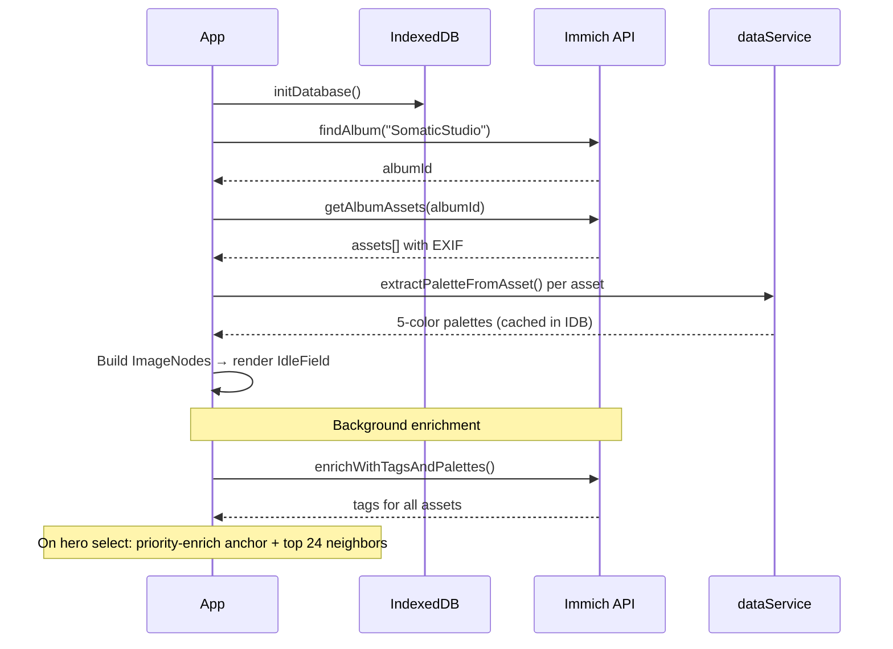

# Somatic Studio

> A photography asset management and discovery system — a living web of memory, color, and light. Navigate by feeling, not folders.


---

## Vision

Every photograph carries memory — not just pixels, but the light that afternoon, the hum of the lens, the season encoded in color. Somatic Studio treats images as nodes in a living network, connected by palette, time, subject, and technical DNA. There are no folders, no albums to scroll. You navigate by feeling.

Tap any image and the system **blooms** — scattering its sprite apart to reveal a fullscreen hero. Scroll past the hero into a trait selector where you pick colors and tags that resonate. At six traits, the album materializes as layered photo prints scattered across the viewport. Scroll deeper to zoom through three tiers of relevance — from the strongest matches down to a blurred waterfall of session-similar images — until the hero itself unblurs beneath. Tap any photo and the cycle begins again.

---

## How It Works

The entire app is a single vertical scroll journey through five phases:

1. **Idle** — Drifting sprites and photo cards fill the viewport; tap any to begin
2. **Blooming** — The sprite scatters apart with staggered CSS transitions; the hero preloads behind
3. **Hero** — Fullscreen image (sticky, progressively blurs 0–16px as you scroll past)
4. **Exploring** — Trait selector slides up over the blurred hero with snap-on-release behavior; pick colors + tags to build an album. Convergence ring sprites appear in the background as traits are selected
5. **Album** — At 6 traits: three tiers of photo prints scattered across the viewport with a zoom-through interaction:
   - **Tier 1** — Large prints (dynamically sized to fill the screen), highest trait matches
   - **Tier 2** — Medium prints scattered with organic jitter, strong trait matches
   - **Waterfall** — Small thumbnails of hero-similar images (same session, shared tags, similar colors), starts blurred and unblurs as you scroll deeper
   - **Hero reveal** — All layers peel away to reveal the original hero, unblurred
   - Each tier drifts subtly and snaps to depth checkpoints on touch/wheel release
6. **Loop** — Tap any album item to bloom into a new hero, new traits, new album

## Key Concepts

| Concept | Definition |
|---------|-----------|
| **ImageNode** | An image from Immich with EXIF metadata, 5-color palette, manual + AI tags, and capture timestamp |
| **MiniSprite** | A procedurally-generated SVG glyph unique to each image, derived from its palette and metadata |
| **FlowPhase** | State machine governing the scroll journey: `idle → blooming → hero → exploring → album` |
| **Trait** | A selected color or tag used to filter the album pool; up to 6 traits per session |
| **Relevance Score** | Composite of temporal proximity, tag overlap, color distance, and technical match (camera/lens) |
| **Waterfall Pool** | Independent set of hero-similar images for the deepest album tier — ranked by same session (+0.5), shared tags (+0.15/tag), and color similarity (threshold 120) |
| **Zoom-Through Depth** | Normalized 0→1 scroll depth controlling the album's layered peel-away effect, with snap points at key tier boundaries |

## Architecture

### Tech Stack

| Layer | Technology |
|-------|-----------|
| Framework | React 19, TypeScript 5.8 |
| Styling | Tailwind CSS v4 (build-time via `@tailwindcss/vite`) |
| Image Service | [Immich](https://immich.app/) — images, EXIF, tags |
| Icons | [Lucide React](https://lucide.dev/) |
| Build | Vite 6 |
| Linting | ESLint + typescript-eslint (errors-only config) |
| Testing | Vitest (jsdom environment) |
| Fonts | `@fontsource` (Inter, JetBrains Mono, Caveat) |
| Storage | IndexedDB (client-side palette cache + user tag edits) |

### File Structure

```
index.html                    → SPA shell, inline styles
index.css                     → Tailwind entry (@import "tailwindcss")
index.tsx                     → React entry, fontsource imports
App.tsx                       → Root component, Immich hydration, renders flow navigation
├── components/
│   └── flow/                     → Flow-state navigation (the entire UI)
│       ├── NavigationPrototype.tsx  → Orchestrator (state machine, scroll layout)
│       ├── MiniSprite.tsx           → SVG sprite with bloom animation
│       ├── BloomOverlay.tsx         → Bloom scatter transition
│       ├── HeroSection.tsx          → Fullscreen hero with scroll-driven blur
│       ├── TraitSelector.tsx        → Color/tag/discovery-tag picker
│       ├── WaterfallAlbum.tsx       → Tiered album with 3-layer zoom-through + waterfall
│       ├── SpriteBackground.tsx     → Convergence ring sprite layer (exploring phase)
│       ├── IdleField.tsx            → Drifting sprite + photo card field
│       ├── flowTypes.ts             → Flow-specific types
│       ├── flowHelpers.ts           → Scoring, color math, seeded random
│       ├── index.ts                 → Barrel export
│       └── flow.css                 → Keyframe animations
├── services/
│   ├── immichService.ts      → Immich API: album discovery, asset loading, tag reading
│   ├── dataService.ts        → Color palette extraction, color math utilities
│   └── resourceService.ts    → IndexedDB persistence (palette cache, user tag edits)
├── scripts/
│   └── migrate-legacy-tags.mjs → One-time migration of Gemini AI tags into Immich
├── types.ts                  → Data models (ImageNode, Tag)
└── vite.config.ts            → Tailwind plugin, Immich proxy, Docker polling
```

### Data Flow



### Image Proxy

All Immich API calls route through `/api/immich/*`, which rewrites to Immich's `/api/*` and injects the API key server-side. The browser never sees the key.

- **Dev:** Vite proxy configured in `vite.config.ts`
- **Prod:** Nginx proxy with upstream keepalive (16 connections) and 7-day browser cache on image responses

## Getting Started

### Prerequisites

- **Node.js** (v18+)
- A running **Immich** instance with a `SomaticStudio` album containing your images
- An **Immich API key** ([how to create one](https://immich.app/docs/features/command-line-interface#obtain-the-api-key))

### Environment

```bash
cp .env.example .env.local
```

Edit `.env.local`:

```bash
# Required: Immich API key for image service access
IMMICH_API_KEY=your_api_key_here

# Optional: Immich server URL (default: http://192.168.50.66:2283)
# IMMICH_URL=http://your-immich-host:2283
```

### Run

```bash
npm install
npm run dev        # localhost:3000
npm run lint       # ESLint (errors-only)
npm run test       # Vitest (single run)
```

On first load, the app discovers the `SomaticStudio` album, fetches EXIF metadata for each asset, and extracts color palettes from thumbnails. Subsequent loads use the IndexedDB palette cache.

## Deployment

Docker containers run on `docker-01` (192.168.50.66):

| Environment | Port | Server |
|-------------|------|--------|
| Production | 3100 | Nginx serving Vite build output |
| Development | 3001 | Vite dev server with hot reload |

```bash
# Update production
ssh user@docker-01 \
  "cd ~/somatic-studio-src && git pull origin main && \
   cd ~/compose-stacks/somatic-studio && docker compose --profile prod up -d --build"

# Update dev
ssh user@docker-01 \
  "cd ~/somatic-studio-src && git fetch origin && git checkout BRANCH && git pull && \
   cd ~/compose-stacks/somatic-studio && docker compose --profile dev up -d --build"
```

Docker infrastructure lives in the DockerAdmin repo at `compose-templates/somatic-studio/`.

## Roadmap

Tracked on [GitHub Projects](https://github.com/users/Ezalis/projects/1) with milestones M1–M4.

### Completed

- [x] **M1: Structural Foundation** — Scoring engine, physics simulation, UI component extraction, ESLint, Vitest, package-lock.json
- [x] **M2: Flow State Navigation (core)** — Flow-state prototype built and decomposed (#19), promoted to primary app as v1.0 (#20)
- [x] Immich integration (replaced local gallery + Gemini AI)
- [x] Nginx upstream keepalive + browser cache headers
- [x] Docker self-hosting (dev + prod)

### In Progress — M2: Flow State Navigation (polish)

- [ ] Shared-attribute labels on album items (#8)
- [ ] Keyboard navigation + URL state + browser back (#9)
- [ ] Mobile responsive flow-state layout (#21)
- [ ] Trail/history visualization (#22)

### Future

<details>
<summary><strong>M3: AI Pipeline</strong></summary>

- [ ] Hybrid AI tagging architecture (ADR) (#11)
- [ ] Server-side AI proxy endpoint (#12)
- [ ] Claude Vision rich tagging (#13)
- [ ] Embedding-based similarity scoring (#14)

</details>

<details>
<summary><strong>M4: 3D Prototype</strong></summary>

- [ ] Rendering abstraction layer (#15)
- [ ] Three.js/R3F scene setup (#16)
- [ ] 3D navigation with depth (#17)

</details>

<details>
<summary><strong>Backlog</strong></summary>

- [ ] Image upload via drag-and-drop or file picker
- [ ] Persistent exploration state across sessions
- [ ] Tag management UI (rename, merge, delete)
- [ ] Advanced search (date range, ISO, aperture, color similarity)
- [ ] Dark mode for UI chrome
- [ ] CI/CD pipeline (GitHub Actions → SSH → Docker rebuild)
- [ ] Nginx reverse proxy with SSL (Let's Encrypt / Tailscale)
- [ ] Multi-user support

</details>
