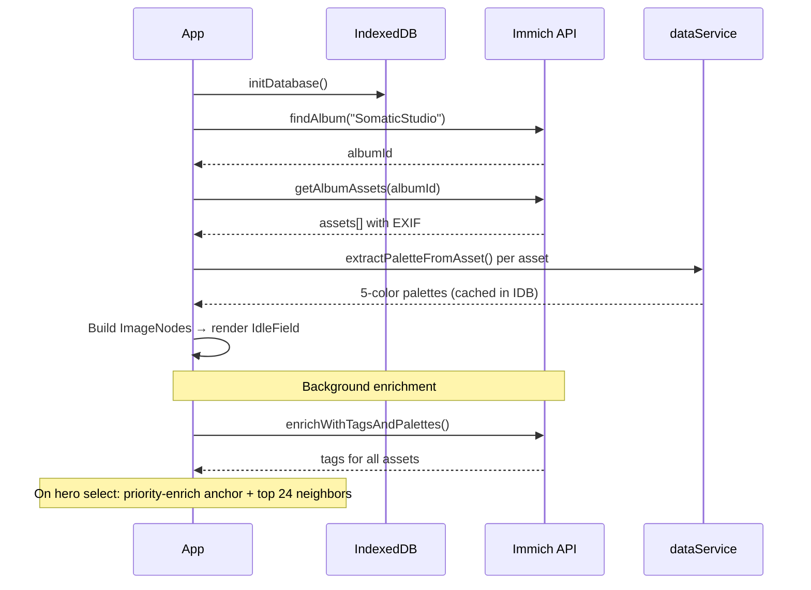

# Somatic Studio

> A living web of memory, color, and light — navigate photographs by feeling, not folders.


---

## Vision

Every photograph carries memory — not just pixels, but the light that afternoon, the hum of the lens, the season encoded in color. Somatic Studio treats images as nodes in a living network, connected by palette, time, subject, and technical DNA. There are no folders, no albums to scroll. You navigate by feeling.

Tap any image and the system **blooms** — scattering its sprite apart to reveal a fullscreen hero. Scroll past the hero into a trait selector where you pick colors and tags that resonate. At six traits, the album materializes as layered photo prints scattered across the viewport. Scroll deeper to zoom through three tiers of relevance — from the strongest matches down to a blurred waterfall of session-similar images — until the hero itself unblurs beneath. Tap any photo and the cycle begins again.

---

## How It Works

The entire app is a single vertical scroll journey through five phases:

1. **Idle** — Drifting sprites and photo cards fill the viewport; tap any to begin
2. **Blooming** — The sprite scatters apart with staggered CSS transitions; the hero preloads behind
3. **Hero** — Fullscreen image (sticky, progressively blurs 0–16px as you scroll past)
4. **Exploring** — Trait selector slides up over the blurred hero with snap-on-release behavior; pick colors + tags to build an album. Convergence ring sprites appear in the background as traits are selected
5. **Album** — At 6 traits: three tiers of photo prints scattered across the viewport with a zoom-through interaction:
   - **Tier 1** — Large prints (dynamically sized to fill the screen), highest trait matches
   - **Tier 2** — Medium prints scattered with organic jitter, strong trait matches
   - **Waterfall** — Small thumbnails of hero-similar images (same session, shared tags, similar colors), starts blurred and unblurs as you scroll deeper
   - **Hero reveal** — All layers peel away to reveal the original hero, unblurred
   - Each tier drifts subtly and snaps to depth checkpoints on touch/wheel release
6. **Loop** — Tap any album item to bloom into a new hero, new traits, new album

### Three Views

After your first hero selection, three tabs appear in the header:

**Explore** — The primary flow-state navigation described above.

**History** — Your session trail rendered as an affinity-layered gallery. Images that appeared across many loops (gravity) sit at the front; range and detour images recede behind. The arc narrative identifies the shape of your exploration: circle-back, deep-dive, wander, or drift. Past sessions are listed and loadable.

**Resonance** — Collective patterns across all visitors. Images sized by how often they've been explored. Indigo ring = convergent pull (people consistently respond the same way). Amber ring = divergent tension (responses split sharply). Sessions are anonymous — no identity, just the shape of each exploration.

## Key Concepts

| Concept | Definition |
|---------|-----------|
| **ImageNode** | An image from Immich with EXIF metadata, 5-color palette, manual + AI tags, and capture timestamp |
| **MiniSprite** | A procedurally-generated SVG glyph unique to each image, derived from its palette and metadata |
| **FlowPhase** | State machine governing the scroll journey: `idle → blooming → hero → exploring → album` |
| **Trait** | A selected color or tag used to filter the album pool; up to 6 traits per session |
| **TrailPoint** | One step in a session: hero image, palette, traits selected, album pool at that step |
| **SessionArc** | Detected exploration pattern across the full trail: circle-back, deep-dive, wander, drift |
| **PersistedSession** | Full trail stored in IndexedDB — survives reloads, resumable within 30 min, pruned after 90 days |
| **Relevance Score** | Composite of temporal proximity, tag overlap, color distance, and technical match (camera/lens) |
| **Waterfall Pool** | Independent set of hero-similar images for the deepest album tier — ranked by same session (+0.5), shared tags (+0.15/tag), and color similarity (threshold 120) |
| **Zoom-Through Depth** | Normalized 0→1 scroll depth controlling the album's layered peel-away effect, with snap points at key tier boundaries |
| **Resonance** | Server-side aggregate of session summaries — tracks convergence (images that pull people the same way) vs. divergence (images that split responses) |
| **AffinityLayer** | In the history gallery: gravity (appeared in most loops), range (moderate overlap), detour (peripheral) |

## Architecture

### Tech Stack

| Layer | Technology |
|-------|-----------|
| Framework | React 19, TypeScript 5.8 |
| Styling | Tailwind CSS v4 (build-time via `@tailwindcss/vite`) |
| Image Service | [Immich](https://immich.app/) — images, EXIF, tags |
| Icons | [Lucide React](https://lucide.dev/) |
| Build | Vite 6 |
| Linting | ESLint + typescript-eslint (errors-only config) |
| Testing | Vitest (jsdom environment) |
| Fonts | `@fontsource` (Inter, JetBrains Mono, Caveat) |
| Client storage | IndexedDB — palettes, tag mappings, full session trails |
| Server storage | SQLite (via `better-sqlite3`) — session summaries for resonance |
| API server | Node.js + Express (`server/`) |
| AI tagging | Ollama (llava:7b + llama3.1:8b) running locally on MacBook Air |

### File Structure

```
index.html / index.css / index.tsx   → SPA shell, Tailwind entry, React entry
App.tsx                              → Root: Immich hydration, DB init, renders flow navigation
├── components/flow/
│   ├── NavigationPrototype.tsx  → Orchestrator (state machine, tabs, session persistence)
│   ├── IdleField.tsx            → Drifting sprites + photo cards (idle phase)
│   ├── BloomOverlay.tsx         → Radial bloom scatter transition
│   ├── HeroSection.tsx          → Fullscreen hero with scroll-driven blur
│   ├── TraitSelector.tsx        → Color + tag trait picker
│   ├── WaterfallAlbum.tsx       → Three-tier zoom-through album (scroll depth 0→1)
│   ├── SpriteBackground.tsx     → Convergence ring sprites (exploring phase)
│   ├── MiniSprite.tsx           → Procedural SVG glyphs per image
│   ├── SessionHistory.tsx       → Affinity-layered gallery + arc narrative + past sessions
│   ├── ArcView.tsx              → Arc pattern detection + narrative text
│   ├── ResonanceView.tsx        → Collective exploration patterns (convergence/divergence)
│   ├── flowTypes.ts             → Shared types (TrailPoint, PersistedSession, etc.)
│   ├── flowHelpers.ts           → Scoring, color math, arc detection, scatter positions
│   └── flow.css                 → Keyframe animations
├── services/
│   ├── immichService.ts      → Immich API client (assets, EXIF, tags, thumbnails)
│   ├── dataService.ts        → Color math, palette extraction, EXIF formatting
│   └── resourceService.ts    → IndexedDB: tags, palettes, sessions (v5 schema)
├── server/
│   ├── index.js              → Resonance API: POST /sessions, GET /data
│   └── Dockerfile            → Standalone Node container
├── types.ts                  → ImageNode, Tag
└── vite.config.ts            → Tailwind, Immich + resonance proxy, Docker hot-reload
```

### Data Flow



### Session Persistence

Two-layer persistence for exploration sessions:

- **Client (IndexedDB)** — Full `TrailPoint[]` trail saved on every hero selection. Survives page reloads. Resume banner appears within 30 minutes of last activity. Past sessions browsable in the history tab. Auto-pruned after 90 days.
- **Server (SQLite)** — Session summary (image IDs, traits per step, arc pattern) POSTed to `server/` API when trail reaches 2+ heroes. Powers the resonance view's aggregate data.

### AI Tagging Pipeline

```
MacBook Air (Ollama, local)
  Pass 1: llava:7b → rich text descriptions per image
  Pass 2: llama3.1:8b → shared taxonomy (55 tags, 5 categories) + per-image assignment
  Post-process: filter broad (>50%) and rare (<2%) tags
  Pass 3: sync to Immich as SomaticStudio/{Category}/{Tag}
```

55 production tags: mood (15), lighting (10), subject (10), setting (10), style (10). All local inference — no cloud dependency.

### Image Proxy

All Immich API calls route through `/api/immich/*`, which rewrites to Immich's `/api/*` and injects the API key server-side. The browser never sees the key.

- **Dev:** Vite proxy → Immich + resonance API
- **Prod:** Nginx proxy with upstream keepalive (16 connections) and 7-day browser cache on image responses

## Getting Started

### Prerequisites

- **Node.js** (v18+)
- A running **Immich** instance with a `SomaticStudio` album containing your images
- An **Immich API key** ([how to create one](https://immich.app/docs/features/command-line-interface#obtain-the-api-key))

### Environment

```bash
cp .env.example .env.local
```

Edit `.env.local`:

```bash
# Required: Immich API key for image service access
IMMICH_API_KEY=your_api_key_here

# Optional: Immich server URL (default: http://192.168.50.66:2283)
# IMMICH_URL=http://your-immich-host:2283
```

### Run

```bash
npm install
npm run dev        # localhost:3000
npm run lint       # ESLint (errors-only)
npm run test       # Vitest (single run)
```

On first load, the app discovers the `SomaticStudio` album, fetches EXIF metadata for each asset, and extracts color palettes from thumbnails. Subsequent loads use the IndexedDB palette cache.

## Deployment

Four Docker containers run on `docker-01`:

| Container | Port | Purpose |
|-----------|------|---------|
| `somatic-prod` | 3100 | Nginx serving Vite build + API proxy |
| `somatic-dev` | 3001 | Vite dev server with hot reload |
| `resonance-api-prod` | — | Resonance API (prod, no external port) |
| `resonance-api-dev` | — | Resonance API (dev, internal only) |

SQLite data persists at `~/somatic-studio-data/resonance/` on docker-01, shared between dev and prod.

```bash
# Deploy dev
ssh thensomethingnew@docker-01 \
  "cd ~/somatic-studio-src && git pull && \
   cd ~/compose-stacks/somatic-studio && docker compose --profile dev up -d --build"

# Deploy prod
ssh thensomethingnew@docker-01 \
  "cd ~/somatic-studio-src && git pull origin main && \
   cd ~/compose-stacks/somatic-studio && docker compose --profile prod up -d --build"
```

Docker infrastructure lives in the DockerAdmin repo at `compose-templates/somatic-studio/`.

## Roadmap

Tracked on [GitHub Projects](https://github.com/users/Ezalis/projects/1) with milestones M1–M4.

### Completed

- [x] **M1: Structural Foundation** — Scoring engine, physics simulation, UI component extraction, ESLint, Vitest
- [x] **M2: Flow State Navigation** — Full flow-state prototype, v1.0 ship, Immich integration, Ollama tagging pipeline
- [x] Session history view — affinity-layered gallery, arc narrative, ArcView
- [x] Session persistence — IndexedDB client-side trails, resume banner, past sessions list
- [x] Resonance system — Express/SQLite API, collective convergence/divergence view, three-tab navigation
- [x] Mobile responsive layout
- [x] Docker self-hosting (dev + prod, 4 containers)

### Next — View Depth & Animation Coherence

- [ ] Scroll-driven depth for history gallery — affinity layers peel like WaterfallAlbum tiers
- [ ] Resonance field depth — scroll through time, older sessions recede and blur
- [ ] Arc narrative scroll-reveal — history text unfolds as you scroll
- [ ] Cross-view continuity — hero image persists as visual anchor when switching tabs
- [ ] Shared-attribute labels on album items (#8)
- [ ] Keyboard navigation + URL state (#9)

### Future

<details>
<summary><strong>M3: AI Pipeline</strong></summary>

- [ ] Hybrid AI tagging architecture (ADR) (#11)
- [ ] Server-side AI proxy endpoint (#12)
- [ ] Claude Vision rich tagging (#13)
- [ ] Embedding-based similarity scoring (#14)

</details>

<details>
<summary><strong>M4: 3D Prototype</strong></summary>

- [ ] Rendering abstraction layer (#15)
- [ ] Three.js/R3F scene setup (#16)
- [ ] 3D navigation with depth (#17)

</details>

<details>
<summary><strong>Backlog</strong></summary>

- [ ] Image upload via drag-and-drop or file picker
- [ ] Persistent exploration state across sessions
- [ ] Tag management UI (rename, merge, delete)
- [ ] Advanced search (date range, ISO, aperture, color similarity)
- [ ] Dark mode for UI chrome
- [ ] CI/CD pipeline (GitHub Actions → SSH → Docker rebuild)
- [ ] Nginx reverse proxy with SSL (Let's Encrypt / Tailscale)
- [ ] Multi-user support

</details>
